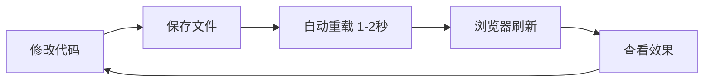

# 🎉 本地开发环境配置成功！

## ✅ 当前状态

Backend 已经成功启动并运行在开发模式！

```bash
$ curl http://localhost:8000/health
{"status":"healthy"}
```

## 🚀 开始开发

### 1. 启动所有服务

```bash
./scripts/dev.sh
```

这会启动：
- ✅ Redis (消息队列)
- ✅ Backend (FastAPI + 热重载)
- ✅ Celery (异步任务)
- ✅ Frontend (Next.js)

### 2. 测试热重载功能

**现在你可以测试热重载了！**

```bash
# 修改一个文件（例如 app/main.py）
vim app/main.py

# 保存后，uvicorn 会自动重载（1-2 秒）
# 查看日志，你会看到：
# INFO:     Application startup complete.
# INFO:     Uvicorn running on http://0.0.0.0:8000
```

**演示：添加一个新的 endpoint**

```python
# 在 app/main.py 添加：
@app.get("/dev-test")
async def dev_test():
    return {"message": "Hot reload works!", "timestamp": datetime.now().isoformat()}
```

保存后：
```bash
# 等待 1-2 秒
curl http://localhost:8000/dev-test

# 应该看到新的 endpoint 响应！
```

### 3. 查看日志

```bash
# 查看 backend 日志
./scripts/dev.sh logs backend

# 查看所有服务日志
./scripts/dev.sh logs

# 实时跟踪日志
docker compose -f docker-compose.yml -f docker-compose.dev.yml logs -f backend
```

### 4. 进入容器调试

```bash
# 进入 backend 容器
./scripts/dev.sh shell backend

# 在容器内运行 Python
python
>>> from app.models.user import User
>>> # 测试你的代码
```

### 5. 停止开发环境

```bash
# 方法 1: Ctrl+C（如果在前台运行）

# 方法 2: 停止服务
./scripts/dev.sh down
```

## 📊 开发工作流程



**核心优势：**
- ⚡️ **即时反馈** - 修改后 1-2 秒看到效果
- 🎯 **环境一致** - 和 EC2 生产环境 100% 相同
- 🛡️ **安全测试** - 本地数据，不影响生产

## 🔧 常用开发命令

```bash
# 启动开发环境
./scripts/dev.sh

# 查看服务状态
docker compose -f docker-compose.yml -f docker-compose.dev.yml ps

# 查看 backend 日志
docker compose -f docker-compose.yml -f docker-compose.dev.yml logs -f backend

# 重启 backend
docker compose -f docker-compose.yml -f docker-compose.dev.yml restart backend

# 进入 backend shell
docker compose -f docker-compose.yml -f docker-compose.dev.yml exec backend bash

# 运行数据库迁移
docker compose -f docker-compose.yml -f docker-compose.dev.yml exec backend alembic upgrade head

# 运行测试
docker compose -f docker-compose.yml -f docker-compose.dev.yml exec backend pytest

# 停止所有服务
docker compose -f docker-compose.yml -f docker-compose.dev.yml down

# 完全清理（包括 volumes）
docker compose -f docker-compose.yml -f docker-compose.dev.yml down -v
```

## 🎯 推送前验证流程

```bash
# 1. 确保开发环境正常
./scripts/dev.sh down

# 2. 构建生产镜像
docker compose build

# 3. 启动生产镜像（本地测试）
docker compose up -d

# 4. 测试
curl http://localhost:8000/health
curl http://localhost:8000/docs  # Swagger UI

# 5. 验证通过，推送代码
git add .
git commit -m "feat: your feature"
git push

# 6. GitHub Actions 自动部署到 EC2
# ✅ 因为本地测试通过，生产环境不会出问题！
```

## 📝 开发技巧

### 1. 快速迭代

```bash
# Terminal 1: 运行开发服务
./scripts/dev.sh

# Terminal 2: 实时查看日志
docker compose -f docker-compose.yml -f docker-compose.dev.yml logs -f backend

# Terminal 3: 编辑代码
vim app/api/auth.py

# 保存后立即在 Terminal 2 看到重载日志
```

### 2. 调试技巧

```python
# 在代码中添加调试日志
import logging
logger = logging.getLogger(__name__)

@app.get("/test")
async def test():
    logger.debug("Debug info: %s", some_variable)
    logger.info("Request received")
    return {"status": "ok"}
```

### 3. 数据库调试

```bash
# 连接到数据库
docker compose -f docker-compose.yml -f docker-compose.dev.yml exec backend python

>>> from app.core.database import engine
>>> from sqlalchemy import inspect
>>> inspector = inspect(engine)
>>> print(inspector.get_table_names())
```

## 🎓 下一步

1. **阅读文档**
   - `docs/WHY_DOCKER_DEVELOPMENT.md` - 为什么用 Docker
   - `docs/DOCKER_VS_MANUAL_DEVELOPMENT.md` - 详细对比

2. **配置 API Keys**
   - 编辑 `.env.local`
   - 填写真实的 `OPENAI_API_KEY`
   - 填写 AWS 凭证（如果要测试 S3）

3. **开始开发**
   - 创建新的 API endpoints
   - 添加新的 models
   - 实现业务逻辑

4. **推送前验证**
   - 构建生产镜像测试
   - 确保一切正常后 push

## 🎉 恭喜！

你的本地开发环境已经完全配置好了！现在可以：
- ⚡️ 快速开发（热重载）
- 🎯 环境一致（Docker）
- 🛡️ 推送前验证（避免生产问题）

Happy coding! 🚀
