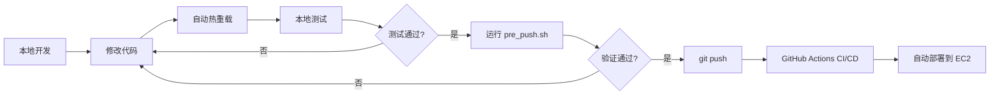

# 本地开发指南 / Local Development Guide

## 🎯 目标 (Goals)

确保本地开发环境与生产环境一致，避免"本地能跑，部署就挂"的问题。

Ensure local development environment matches production to avoid "works on my machine" issues.

---

## 🚀 快速开始 (Quick Start)

### 1. 首次设置 (First Time Setup)

```bash
# 1. 复制环境变量模板
cp .env.local.example .env.local

# 2. 编辑 .env.local，填入真实的配置
# 建议：使用相同的 RDS 数据库，但可以用不同的 S3 bucket
nano .env.local

# 3. 启动开发环境
./scripts/dev_start.sh
```

### 2. 日常开发 (Daily Development)

```bash
# 启动开发环境
./scripts/dev_start.sh

# 查看日志
docker compose logs -f backend
docker compose logs -f frontend

# 停止环境
./scripts/dev_stop.sh
```

### 3. 推送前验证 (Pre-Push Validation)

```bash
# 运行所有验证检查
./scripts/pre_push.sh

# 如果全部通过，安全推送
git add .
git commit -m "your message"
git push
```

---

## 🔧 开发模式特性 (Development Features)

### Backend (FastAPI)
- ✅ **Hot Reload**: 修改 Python 代码自动重启
- ✅ **Debug Mode**: 详细的错误信息和堆栈跟踪
- ✅ **Volume Mount**: 代码实时同步，无需重新构建镜像
- ✅ **Interactive Debugging**: 可以使用 `breakpoint()` 或 `pdb`

### Frontend (Next.js)
- ✅ **Fast Refresh**: React 组件热替换
- ✅ **Source Maps**: 方便调试
- ✅ **Development Server**: 错误提示更友好

### Celery
- ✅ **Debug Logging**: 任务执行详细日志
- ✅ **Code Reload**: 修改任务代码后自动重启 worker

---

## 📁 文件结构 (File Structure)

```
AI-job-matching/
├── docker-compose.yml           # 生产配置 (Production config)
├── docker-compose.dev.yml       # 开发覆盖 (Dev overrides)
├── .env                         # 生产环境变量 (Production env)
├── .env.local                   # 本地环境变量 (Local env, gitignored)
├── .env.local.example           # 模板 (Template)
│
├── scripts/
│   ├── dev_start.sh            # 启动开发环境
│   ├── dev_stop.sh             # 停止开发环境
│   ├── pre_push.sh             # 推送前验证
│   ├── view_logs.sh            # 查看 EC2 日志
│   ├── start_services.sh       # EC2 启动服务
│   └── stop_services.sh        # EC2 停止服务
```

---

## 🔄 开发工作流 (Development Workflow)



### 具体步骤 (Steps)

1. **启动开发环境**
   ```bash
   ./scripts/dev_start.sh
   ```

2. **修改代码**
   - Backend: 编辑 `app/` 目录下的文件
   - Frontend: 编辑 `frontend/` 目录下的文件
   - 保存后自动重载，立即看到效果

3. **本地测试**
   - 访问 `http://localhost:8000/docs` 测试 API
   - 访问 `http://localhost:3000` 测试前端
   - 使用 `docker compose logs -f` 查看日志

4. **数据库迁移** (如果修改了模型)
   ```bash
   # 生成迁移
   docker compose exec backend alembic revision --autogenerate -m "描述"
   
   # 应用迁移
   docker compose exec backend alembic upgrade head
   ```

5. **推送前验证**
   ```bash
   ./scripts/pre_push.sh
   ```

6. **提交并推送**
   ```bash
   git add .
   git commit -m "feat: 添加新功能"
   git push
   ```

7. **监控部署**
   - 在 GitHub 查看 Actions 进度
   - 或使用 `./scripts/view_logs.sh` 查看 EC2 日志

---

## 🎨 开发技巧 (Development Tips)

### 1. 使用相同的数据库

**推荐**: 本地开发使用相同的 RDS 数据库

✅ **优点**:
- 数据一致性
- 测试真实数据
- 避免本地/生产数据差异

⚠️ **注意**:
- 不要在生产库上做破坏性测试
- 考虑创建单独的开发数据库

### 2. 使用不同的 S3 Bucket

**推荐**: 创建一个开发专用的 S3 bucket

```bash
# 在 .env.local 中
S3_BUCKET_NAME=ai-job-matching-dev
```

✅ **优点**:
- 避免污染生产数据
- 可以随意测试上传/删除

### 3. 快速重启单个服务

```bash
# 只重启 backend
docker compose restart backend

# 只重启 celery
docker compose restart celery

# 查看特定服务日志
docker compose logs -f backend
```

### 4. 进入容器调试

```bash
# 进入 backend 容器
docker compose exec backend bash

# 运行 Python 交互式环境
docker compose exec backend python

# 测试数据库连接
docker compose exec backend python -c "from app.core.database import engine; print(engine.url)"
```

### 5. 清理并重新开始

```bash
# 停止并删除所有容器和卷
./scripts/dev_stop.sh
docker compose -f docker-compose.yml -f docker-compose.dev.yml down -v

# 重新构建镜像
docker compose -f docker-compose.yml -f docker-compose.dev.yml build --no-cache

# 重新启动
./scripts/dev_start.sh
```

---

## 🐛 常见问题 (Troubleshooting)

### 问题: 代码修改后没有自动重载

**解决**:
```bash
# 检查 volume 挂载是否正确
docker compose config

# 重启服务
docker compose restart backend
```

### 问题: 端口已被占用

**解决**:
```bash
# 查看端口占用
lsof -i :8000
lsof -i :3000

# 停止占用端口的进程
kill -9 <PID>
```

### 问题: 数据库连接失败

**解决**:
```bash
# 检查 DATABASE_URL 是否正确
docker compose exec backend env | grep DATABASE_URL

# 测试数据库连接
docker compose exec backend python -c "
from app.core.database import engine
try:
    engine.connect()
    print('✅ Database connection successful')
except Exception as e:
    print(f'❌ Database connection failed: {e}')
"
```

### 问题: Docker 镜像太大，构建太慢

**解决**:
```bash
# 定期清理 Docker
docker system prune -a

# 使用缓存加速构建
docker compose build --parallel
```

---

## 📊 对比：本地 vs 生产 (Local vs Production)

| 功能 | 本地开发 | 生产环境 |
|------|---------|---------|
| 代码重载 | ✅ 自动 | ❌ 需要推送 |
| 调试模式 | ✅ 开启 | ❌ 关闭 |
| 日志级别 | DEBUG | INFO |
| 数据库 | 共享 RDS 或本地 | RDS |
| S3 Bucket | 开发专用 | 生产 |
| 镜像构建 | 本地构建 | GitHub Actions |
| 部署方式 | docker compose | CI/CD |
| HTTPS | ❌ HTTP | ✅ 可选 |

---

## 🎓 下一步 (Next Steps)

1. ✅ **设置本地环境**: 完成上面的"首次设置"
2. ✅ **熟悉工作流**: 修改一个小功能并推送
3. 📚 **学习最佳实践**: 阅读 FastAPI 和 Next.js 文档
4. 🧪 **添加测试**: 编写单元测试和集成测试
5. 🚀 **优化性能**: 使用性能分析工具

---

## 📞 需要帮助? (Need Help?)

- 查看日志: `docker compose logs -f`
- 检查服务状态: `docker compose ps`
- 运行验证: `./scripts/pre_push.sh`
- 查看文档: `docs/` 目录

Happy Coding! 🎉
